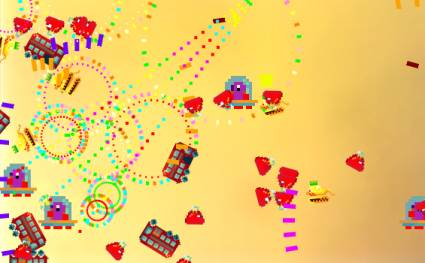

# Конкурс №123 "Arena Shooter III"

"Жизнь - борьба". Нет, не так. "Жизнь - вооруженная борьба". Или даже так: "Жизнь - стрельба".

Темой нового конкурса становятся игры про стрельбу в замкнутом пространстве.

**Основные правила:**
* Главный герой.
* Враги.
* Стрельба.

Остальное - на ваш вкус.

**Бонусы будем давать за:**
* Размер сборки игры меньше 96Kb (98304 байт).
* Рикошеты. Не важно, от врагов или от препятствий. Свистящий звук обязателен.
* Специальный бонус будет выдан администрацией за сочные эффекты и звуки. Больше взрывов и искр! Хм, для бога взрывов и искр.

Конкурс продлится по 18-е мая включительно. Ограничение на размер - 40 Мб.
Публиковать и показывать предварительные версии работ, исходные коды, материалы разработки - можно и нужно.

P.S. У нас богатая история подобных конкурсов. Как минимум можно посмотреть на [тут](http://igdc.ru/igdc_top.php?konkurs=92), [здесь](http://igdc.ru/igdc_top.php?konkurs=75) и [вот тут](http://igdc.ru/viewpage.php?page_id=30). Вдохновляйтесь!
